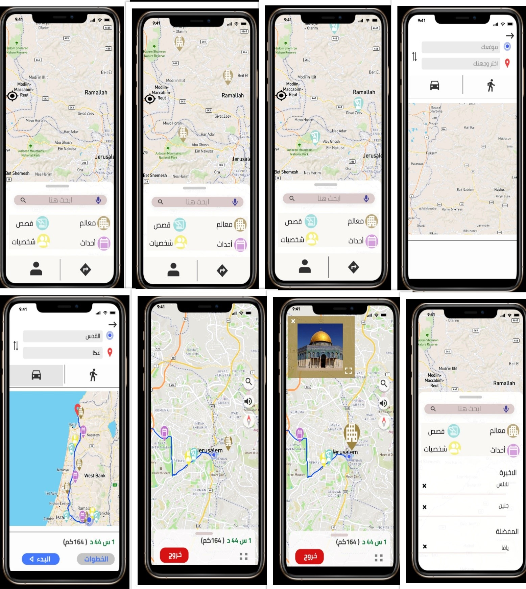

# Project Scope

## Introduction
In the past decade, the internet has become a vast source of information on various topics worldwide, including Palestine. However, the Palestinian case is unique due to the presence of websites and blogs that often distort facts about the Palestinian issue. This misinformation has led to confusion regarding historical events and places in Palestine. Moreover, many people spend a significant amount of time commuting daily, often engaging in unproductive activities such as browsing social media or messaging. Recognizing this opportunity, we propose an application aimed at making daily commutes more productive by providing users with educational content about Palestinian history, culture, and landmarks.

## Project Overview
Our project focuses on developing a community-based mapping and navigation application that serves as a tourist guide to places of interest in Palestine. The application aims to empower the Palestinian narrative by providing accurate information about historical, cultural, and religious sites. By utilizing users' daily commute time, the application seeks to educate and engage users in learning about Palestinian heritage.

## Objectives
1. **Empowering the Palestinian Narrative**: Combat misinformation by providing accurate and reliable information about Palestinian history and culture.
2. **Utilizing Commute Time**: Make daily commutes more productive by offering educational content during travel.
3. **Promoting Cultural Awareness**: Increase awareness and appreciation of Palestinian heritage among local and international users.

## Features
- **Community-Based Mapping**: Users can contribute information about local landmarks, historical sites, and cultural events.
- **Tourist Guide**: Provides users with information about places of interest along their commute route.
- **Multilingual Support**: The application supports both English and Arabic languages to cater to local and international users.
- **Integration with Google Maps**: Utilizes Google Maps API for navigation and location-based services.

  
## Graphic Prototype

## Data Sources
- **بلادنا فلسطين (مصطفى مراد الدباغ)**: A source of information on Palestinian history and culture.
- **Palestine Remembered**: Provides historical information and documentation related to Palestine.
- **فلسطين الارض المقدسة- الدليل السياحي لأهم المواقع التاريخية والسياحية (محمود العباسي)**: Offers a tourist guide to significant historical and tourist sites in Palestine.

## Contact
For inquiries or suggestions, please contact (slsabeelabuhammad@gmail.com) or (linkedin.com/in/halima-anqawi-841ab2207).
